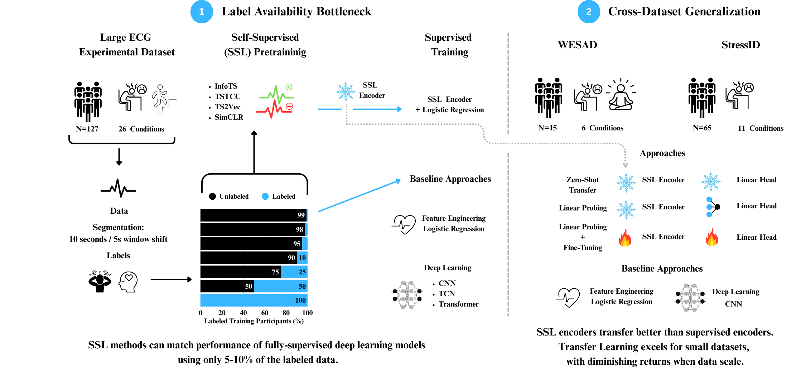

# Beyond Supervision: Evaluating Contrastive Self-Supervised Learning Techniques for Electrocardiogram-Based Mental Stress Detection

**Authors:** [Buelent Uendes](https://buelentuendes.github.io/), [Carlos Laborda Gisbert](https://github.com/Carlos-Laborda), and Mark Hoogendoorn

This project explores mental stress detection using an ECG Dataset compromising 127 participants across 26 different conditions using both supervised and self-supervised learning (SSL) methods. It benchmarks CNNs, TCN, Transformers, and contrastive SSL approaches such as SimCLR, TSTCC, TS2Vec, and InfoTS, with a special focus on label efficiency. It also considers the S3 augmented version of the contrastive SSL approaches.

In the self-supervised setting, once encoders are pre-trained, they are frozen and their learned representations are used to train lightweight linear classifiers.

For the cross-dataset generalization, two additional datasets, StressID and WESAD were considered and the best-performing SSL method (TS-TCC and TS-TCC+S3) were compared to supervised encoders (CNN) using zero-shot, linear-probing (LP), and LP+fine-tuning (LP+FT).

The following figure illustrates the overall experimental setup:

<p align="center">
  
</p>

## Table of Contents

- [Installation and Environment Setup](#installation-and-environment-setup)
- [Project Structure](#project-structure)
- [Running the Preprocessing Pipeline](#running-the-preprocessing-pipeline)
- [Running the Training Pipelines (Locally)](#running-the-training-pipelines-locally)
  - [Running Locally](#running-the-training-pipelines-locally)
  - [Transfer learning results](#transfer-learning-results)

## Installation and Environment Setup

This project uses a Conda environment with Python 3.11 and additional dependencies managed via `pip`.

### Create the environment and install modules

```bash
conda env create -f environment.yml
conda activate ECG-Project
pip3 install . 
```

## Project Structure

```text
.
├── README.md                  # Project overview and usage guide
├── environment.yml            # Conda environment definition
├── requirements.txt           # Optional pip requirements
├── setup.py                   # Python config file for setuptools, needed for the sia package

├── sia/                       # A module that facilitates window segmentation and feature engineering of standard ECG-based features  

├── graphical_pictures/        # Contains the graphical figure in pdf and png format

├── STRESSID_transfer_learning # Contains scripts for the transfer learning to STRESSID

├── WESAD_transfer_learning    # Contains scripts for the transfer learning to WESAD

├── graphical_pictures/        # Contains the graphical figure in pdf and png format

├── utils/                     # Utilities directories
│   ├── __init__.py            # Init file  
│   ├── helper_paths.py        # Paths 
│   ├── torch_utilities.py     # Helper functions (training loop, metrics, etc.)

├── create_figures/            # Python scripts to create figures
│   ├── create_figure_results  
│   ├── create_runtime_analysis_plot.py     
│   ├── data_visualization.py  # Script to create the UMAP visualization of the datasets

├── statistical_analysis/      # Python scripts to analyze the results
│   ├── archive/               # Archived files for additional analysis (can be ignored)
│   ├── aggregate_results_for_table_statistical_analysis.py     
│   ├── aggregate_results_transfer_learning.py  

├── data/                      # Data directories
│   ├── raw/                   # Original datasets
│   ├── external/              # Third-party or reference datasets
│   ├── interim/               # Intermediate transformation outputs
│   └── processed/             # Final input data used for modeling

├── domain_specific_ml/        # File directory for feature engineering
│   ├── archive/                       # Archive files
│   ├── feature_extraction.py          # Extraction of the features
│   ├── train_simple_classifiers.py    # Logistic regression with features
│   └── train_simple_classifiers.sh    # Bash script for training and zero-shot evaluation

├── preprocessing_pipeline/    # Metaflow pipeline to preprocess raw ECG data
│   ├── preprocess_no_flow.py  # Main preprocessing file
│   ├── downsample.py          # Script to downsample the WESAD and van der Mee dataset to the same 500 Hz
│   ├── config.py              # Data configuration
│   └── common.py              # Cleaning and Preprocessing functions
│   ├── wesad/                 # WESAD preprocessing pipeline
│       ├── common.py
│       ├── config.py
│       ├── wesad_preprocessing_pipeline.py
│       ├── wesad_preprocessing_raw_data.py                                                         
│   ├── stress_id/             # StressID preprocessing pipeline
│       ├── common.py                
│       ├── config.py
│       ├── stressid_preprocessing_pipeline.py

├── models/                    # Core model definitions
│   ├── supervised.py          # CNN, TCN, Transformer and Linear and MLP classifiers
│   ├── simclr.py              # SimCLR encoder + projection head
│   ├── ts2vec.py              # TS2Vec architecture
│   ├── tstcc.py               # TSTCC architecture
│   ├── infots.py              # InfoTS architecture  
│   └── __init__.py

├── training_pipelines/        # Training pipelines for training the models
│   ├── infots_train_cleaned_cv.py
│   ├── supervised_train_cleaned_cv.py
│   ├── simclr_train_cleaned_cv.py
│   ├── ts2vec_train_cleaned_cv.py
│   ├── tstcc_train_cleaned_cv.py
│   ├── sophisticated_baseline_cleaned_cv.py
│   ├── slurm_jobs/            # SLURM job directory
│       ├── ...                # Individual slurm files for training on a cluster
│   ├── bash_scripts/          # Bash scripts
│       ├── ...                # Individual bash scripts to run specific models
│   └── models -> ../models    # Symlink for shared access
│   └── archive                # Unused files (can be ignored)

├── results/                   # Generated results and figures
├── figures/                   # Generated figures of the results

└── LICENSE                    # License file
```

## Running the Preprocessing Pipeline

The preprocessing pipeline segments, cleans, normalizes, and windows the raw ECG data.

### 1. Activate the environment
```bash
conda activate ECG-Project
```

### 2. Start the MLflow tracking server
```bash
mlflow server --host 127.0.0.1 --port 5000
```

### 3. Run the preprocessing pipeline
```bash
python3 preprocessing_pipeline/preprocess_no_flow.py
```

This will:
- Segment the raw ECG data
- Clean and denoise signals
- Normalize all recordings
- Segment signals into fixed-length windows

The final output is saved to:
```bash
data/interim/<DATASET>/<SAMPLE_FREQUENCY>/<WINDOW SIZE>/<WINDOW_SHIFT>/windowed_data.h5
```

Note: For the transfer learning results, we downsampled the dataset by van der Mee first to 500 Hz, and re-ran the above pipeline.
To downsample the dataset to 500, run

```bash
python3 preprocessing_pipeline/downsample_ecg.py --desired_sampling_rate 500
```

where one can replace the desired_sampling_rate to 700 for the WESAD dataset, respectively.

#### Preprocessing StressID and WESAD

To preprocess the two external datasets, one needs to navigate to their respective 
folders within the preprocessing_pipeline folder and run the respective preprocessing scripts, i.e., 

**Stress ID**
```bash
cd preprocessing_pipeline/stress_id
python3 stressid_preprocessing_preprocessing_pipeline.py
```
**WESAD**
```bash
cd preprocessing_pipeline/wesad
python3 wesad_preprocessing_raw_data.py
python3 wesad_preprocessing_pipeline.py
```

### 3. Extract handcrafted features
To extract the features used in this study, navigate to:

```bash
cd domain_specific_ml
```
To extract the features for the 10s and 5s window overlap run:

```bash
python3 feature_extraction.py --window_size 10 --window_shift 5 --dataset ours
```

Via CLI one can adjust the dataset, as well as the window size (30s) and window shift (5s). Note:
When window size 10s is selected, 25 features will be extracted as opposed to 55 features for the longer time window.

To extract the feature-engineered baselines for WESAD and StressID, one needs to run

**WESAD**
```bash
python3 feature_extraction.py --window_size 10 --window_shift 5 --dataset "wesad" --sample_frequency 700
```
**StressID**
```bash
python3 feature_extraction.py --window_size 10 --window_shift 5 --dataset "stressid" --sample_frequency 500
```

## Running the Training Pipelines (Locally) 

This section shows how to run supervised and self-supervised training pipelines locally.

### 1. Activate the environment

```bash
conda activate ECG-Project
```

### 2. Run a Supervised or Self-Supervised Training Pipeline

From the `training_pipelines/` directory, you can run any Metaflow training script by specifying its parameters through the CLI.

#### Example (Supervised)

```bash
python3 supervised_training.py \
  --model_type "cnn" \
```
Available supervised models: cnn, tcn, transformer.

#### Example (Self-Supervised)
```bash
python3 tstcc_train_cleaned_cv.py 
```
The corresponding flow will:
- Pretrain a self-supervised encoder (e.g., TS2Vec, TSTCC, SimCLR, InfoTS) 
- Freeze the encoder.
- Extract latent representations.
- Train a downstream classifier (linear) with (limited) labeled data.
- Evaluate the classifier on test set.

Replace the script name (ts2vec_train_cleaned_cv.py, simclr_train_cleaned_cv.py, infots_train_cleaned_cv.py) to run different SSL methods. 
Each script has several different model-specific CLI parameters.

## Transfer learning results

### Zero-shot transfer

#### Feature-engineered baseline
For the zero-shot transfer results for the logistic regression run the following:

```bash
cd domain_specific_ml
mlflow server --host 127.0.0.1 --port 5000
python3 train_simple_classifiers.py --zero_shot_evaluation --zero_shot_dataset "wesad" --fs 700
```
For the StressID, one can run the same command, replacing "wesad" with "stressid" and fs set to 500

#### Supervised Encoder

For the supervised encoder (cnn), one can obtain the zeros-shot, linear probing and LP+FT results in the following manner:
Navigate to the training_pipelines:

```bash
cd training_pipelines
```

To obtain the zero-shot transfer (for WESAD, replace "wesad" with "stressid" for StressID)

**Zero-shot**
```bash
python3 supervised_training_cleaned_cv.py --zero_shot_evaluation --zero_shot_dataset "wesad"
```

#### TS-TCC and TS-TCC+S3
```bash
python3 tstcc_train_cleaned_cv.py --zero_shot_evaluation --zero_shot_dataset "wesad" --fs 700
```

For "StressID" one needs to use the following:
```bash
python3 tstcc_train_cleaned_cv.py --zero_shot_evaluation --zero_shot_dataset "stressid" --fs 500
```
For the S3 version, one needs to use the --use_s3_layers option.

### Linear Probing (LP)

#### CNN
For the LP results for the CNN, one can obtain the results for WESAD via 
```bash
cd training_pipelines
python3 supervised_training_cleaned_cv.py --use_pretrained_encoder --dataset "wesad" --fs 700
```
For StressID
```bash
cd training_pipelines
python3 supervised_training_cleaned_cv.py --use_pretrained_encoder --dataset "stressid" --fs 500
```
#### TS-TCC

**WESAD**
```bash
cd WESAD_transfer_learning
python3 tstcc_train_cleaned_cv.py --use_pretrained_encoder 
```

**StressID**
```bash
cd WESAD_transfer_learning
python3 tstcc_train_cleaned_cv.py --use_pretrained_encoder 
```

For both results, using the --use_s3_layers will get the results for the S3 augmented version.

### Linear Probing + Fine-Tuning (LP+FT)

#### CNN
For the LP results for the CNN, one can obtain the results for WESAD via 
```bash
cd training_pipelines
python3 supervised_training_cleaned_cv.py --use_pretrained_encoder --fine_tune_encoder --dataset "wesad" --fs 700
```
For StressID
```bash
cd training_pipelines
python3 supervised_training_cleaned_cv.py --use_pretrained_encoder --fine_tune_encoder --dataset "stressid" --fs 500
```

#### TS-TCC (and TS-TCC+S3)
**WESAD**
```bash
cd WESAD_transfer_learning
python3 tstcc_train_cleaned_cv.py --use_pretrained_encoder --fine_tune_encoder
```

**StressID**
```bash
cd WESAD_transfer_learning
python3 tstcc_train_cleaned_cv.py --use_pretrained_encoder --fine_tune_encoder
```
For both results, using the --use_s3_layers will get the results for the S3 augmented version.

#### Trained from scratch baselines


<!-- 
MULTILINE COMMENT

## Running the Training Pipelines on DAS6 Cluster

This section explains how to run experiments remotely on the DAS6 cluster using SLURM.

### 1. Activate Environment and Launch MLflow on DAS6

On the cluster login node:

```bash
source activate /var/scratch/username/ECG_env
mlflow server --host 0.0.0.0 --port 5005
```

### 2. Accessing MLflow Remotely

Then, on your local machine, open a tunnel to access MLflow:

```bash
ssh -L 5005:127.0.0.1:5005 username@fs0.das6.cs.vu.nl
```

Now you can view MLflow from your browser at:
```cpp
http://localhost:5005
```

### 3. SLURM Job Configuration

Edit `train.sh` to uncomment the model script you want to run. This script includes setups for:

- **Supervised models:** CNN, TCN, Transformer
- **SSL models:** TS2Vec, TS2VecSoft, TSTCC, TSTCCSoft, SimCLR
- **Transfer learning:** Using TS2VecSoft encoder trained on PPG signals

Example snippet from `train.sh` (CNN):

```bash
python supervised_training.py run \
  --mlflow_tracking_uri "http://fs0.das6.cs.vu.nl:5005" \
  --window_data_path "../../../../var/scratch/cla224/ECG-Project/data/windowed_data.h5" \
  --model_type "cnn" \
  --seed $1 \
  --batch_size 16 \
  --scheduler_factor 0.5 \
  --scheduler_min_lr 1e-09 \
  --patience 20 \
  --lr 1e-5 \
  --label_fraction 0.01
```

> **Note:** Use only one model block per SLURM run to avoid conflicts.

### 4. Launching Training Jobs

Submit training jobs with different random seeds:

```bash
for SEED in 1 42 1234 1337 2025; do
    sbatch train.sh $SEED
done
```

Logs will be written to `ecg_train.out` and `ecg_train.err` in the current working directory and everything will be tracked in MLflow.
  -->


### Acknowledgements

This work is funded by [Stress in Action](www.stress-in-action.nl). The research project [Stress in Action]( www.stress-in-action.nl) is financially supported by the Dutch Research Council and the Dutch Ministry of Education, Culture and Science (NWO gravitation grant number 024.005.010).
